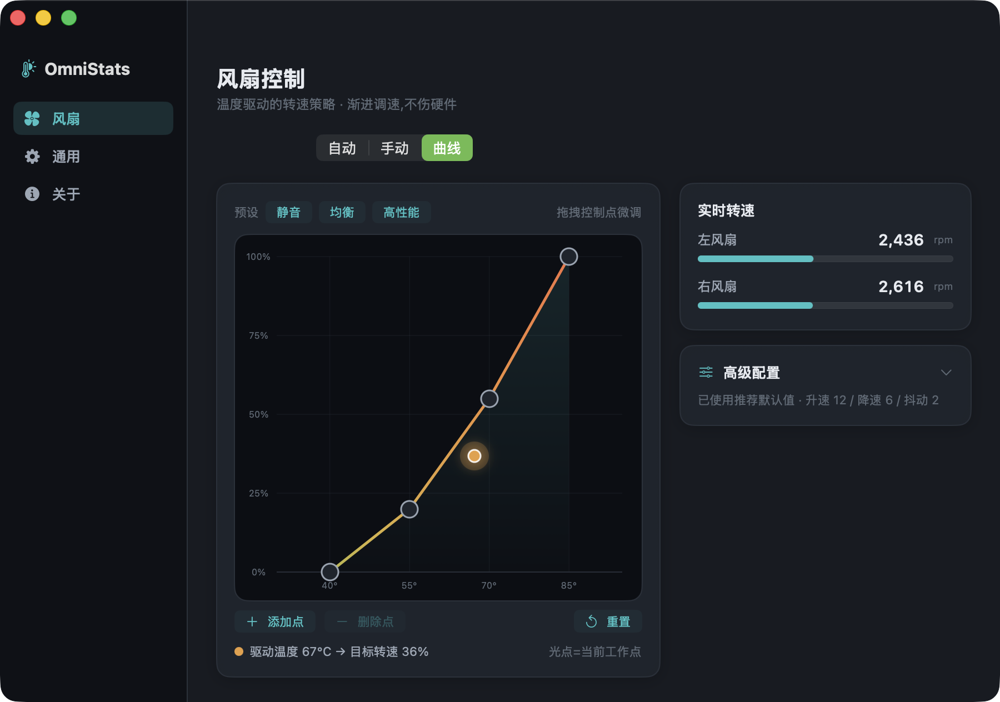
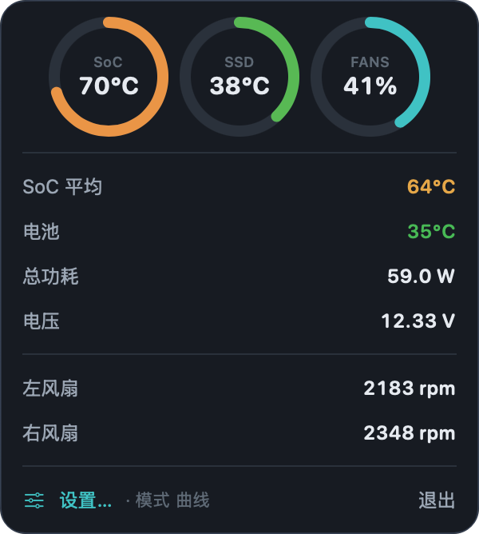
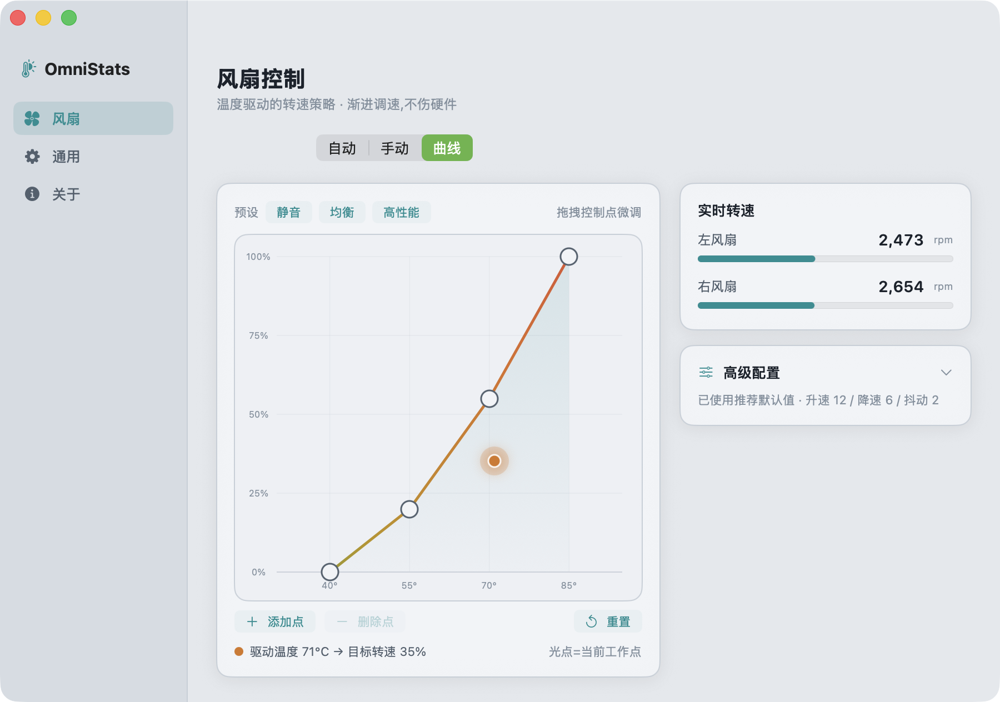

<div align="center">

# OmniStats

**轻量的 Apple Silicon 菜单栏系统监控 —— 且能真正控制风扇。**

[](https://github.com/SuooL/OmniStats/actions/workflows/ci.yml)
[](LICENSE)


[English](README.md) · 简体中文



</div>

## 简介

OmniStats 常驻菜单栏,一眼看到 SoC / SSD / 电池温度、功耗与风扇转速。和多数监控工具不同,它能在 Apple Silicon 上**真正调节风扇**——通过温度→转速曲线,并采用硬件友好的渐进调速。

> 温控只是第一个模块。网速、磁盘、电池等面板已在路线图上——OmniStats 会成长为完整的系统仪表盘。

已在 **M5 Pro (Mac17,8)** 上完整验证。风扇控制适用于固件暴露可写风扇 key 的 Apple Silicon 机型(见[风扇控制原理](#风扇控制原理))。

## 功能

- 🌡 菜单栏显示最高 SoC 温度 + 圆环仪表
- 📈 交互式**温度→转速曲线**,带实时工作点光标
- 🌀 **自动 / 手动 / 曲线** 三种模式;自动适配各机型不同风扇上限
- 🧊 **硬件友好调速**:温度 EMA 平滑 + 死区滞回 + 限斜率渐进——不会因 1° 抖动来回窜
- 🎛 一键曲线预设(静音 / 均衡 / 高性能)
- 🎨 深色 / 浅色"热学仪表"双主题
- 🔒 应用内一键安装 root 助手(系统原生授权一次,无需终端)
- ⬆️ 内置更新检查,可一键自更新
- 🪶 原生 SwiftUI,极轻,无 Electron、无后台臃肿

## 截图

| 菜单栏 | 风扇曲线(深色) | 风扇曲线(浅色) |
|---|---|---|
|  |  |  |

## 安装

### 从源码构建

需要 Command Line Tools(`xcode-select --install`),无需完整 Xcode。

```bash
git clone https://github.com/SuooL/OmniStats.git
cd OmniStats
make
open dist/OmniStats.app
```

首次打开可能被 Gatekeeper 拦截(未公证)。右键 → **打开**,或:

```bash
xattr -dr com.apple.quarantine dist/OmniStats.app
```

### 启用风扇控制

在应用里点**启用风扇控制**,授权一次即可——OmniStats 会替你安装一个 root 助手(LaunchDaemon),无需终端。随时可在**关于 → 移除助手**卸载。

## 风扇控制原理

Apple Silicon 风扇由 SMC 管理。OmniStats 以 root 写两个 SMC key 来控制:

| Key       | 含义                                    |
|-----------|-----------------------------------------|
| `F<n>md`  | 模式 —— `0` 固件自动,`1` 手动           |
| `F<n>Tg`  | 目标转速(钳制到 `F<n>Mn`…`F<n>Mx`)     |

顺序:先 `F<n>md = 1`,再写 `F<n>Tg`。注意 M 系列是**小写** `md`(旧机型/Intel 是 `F0Md`);OmniStats 两者都探测。无风扇机型(如 MacBook Air)自动降级为纯监控。

温度取自私有 `IOHIDEventSystemClient` 传感器;风扇转速与功耗来自 SMC。

## 硬件友好调速

转速绝不被生拉硬拽,三层保证平滑:

1. **温度平滑** —— 驱动温度是指数滑动平均(~6 秒),瞬时尖峰不会引起风扇窜动。
2. **死区滞回** —— 新目标与当前指令差异在小范围内则不动,避免持续微调。
3. **限斜率** —— 真要调整时,指令按每秒最大步进渐进逼近。

三者均可在**风扇 → 高级配置**调节,并支持一键还原。

## 安全性

- 目标转速钳制在各风扇自身 `Mn`…`Mx` 区间。
- **看门狗**:应用断连或卡死时,所有风扇自动回落固件自动;退出应用也会还原。
- 仅极小的 `omnistats-smcd` 助手以 root 运行,并校验对端 uid,防止其他本地账户劫持风扇。

## 更新

**关于 → 软件更新** 会检查 GitHub Releases,可就地下载并安装新版本。发布通过打 `vX.Y.Z` 标签产生(见 [CONTRIBUTING](CONTRIBUTING.md))。

## 路线图

- [ ] 网速模块
- [ ] CPU/GPU/内存占用
- [ ] 磁盘活动与电池健康
- [ ] 每风扇独立曲线
- [ ] Homebrew cask

## 参与开发

分支流程为 `feature/*` → `dev` → `main`。见 [CONTRIBUTING.md](CONTRIBUTING.md)。

## 许可

[MIT](LICENSE)
